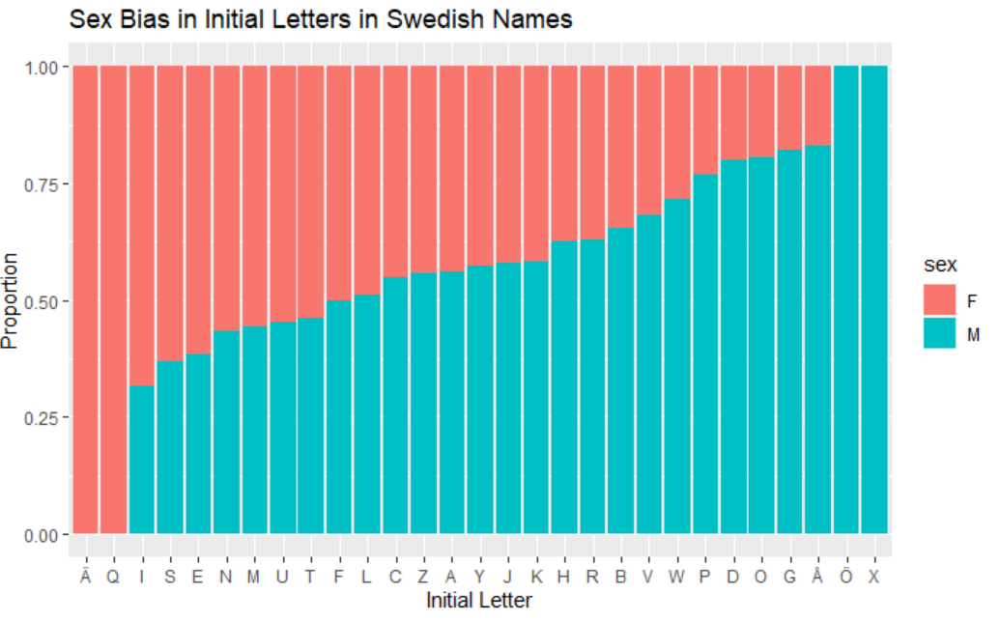
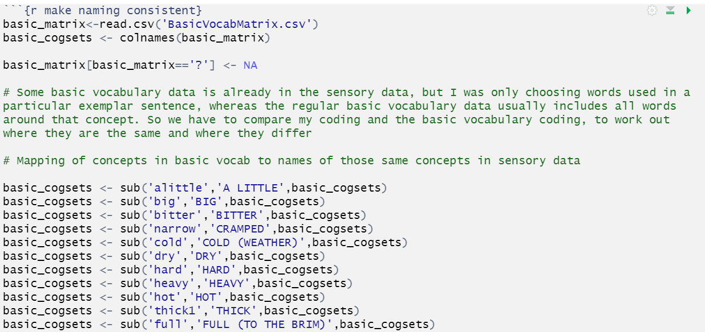

```{r, warning=FALSE, include=FALSE}
library(tidyverse)
knitr::opts_chunk$set(echo = TRUE,warning = FALSE,message = FALSE)

```

# New stuff on Studium

- I have uploaded feedback and a sample answer for the first homework in studium, in the module for Lecture 2
- I have also uploaded a **course cheatsheet** under the cheatsheets module
- This is a summary of all the functions we have learnt so far, and I will keep adding to it and updating it as we go along
- You will find it very useful when you are doing the homework assignments and the final assignment!

# More data wrangling

* Last week we learnt about `filter()` and `select()`
* Today we'll learn some more functions for data wrangling, again working with the nettle data

```{r message=FALSE,warning=FALSE}
nettle <- read_csv("data/nettle_1999_climate.csv")
head(nettle)
```

## Renaming columns in pipes

We've already learnt how to rename columns using indexing.

If you want to do this in a pipe, you can use the function `rename()`, like this:

```{r}
                # New name = Old Name
nettle %>% rename(Pop=Population)->nettle
nettle
```

## mutate() adds columns

Sometimes the information you want is "buried" in your data and you need to dig it out with a new column.  For example, the Nettle language diversity data has each country's population and area in it, so we can easily add a column for population density:

```{r}
nettle %>% 
  mutate(PopDensity=Pop / Area) %>% 
  arrange(-(PopDensity))
```

Sometimes the new column isn't derived from other columns.

For example, here we add a column ID to give every row a unique ID:

```{r}
nettle %>% 
  mutate(ID=1:nrow(nettle))
```

The `nrow()` function returns the number of rows in a dataset.

We might also want to add a column 'Source' indicating the source of this data. In this case, all the data comes from Nettle (1999):

```{r}
nettle %>% 
  mutate(Source="Nettle (1999)")
```

## Pro tip!

When writing pipelines, you can always use the variable name `.` to refer to "the thing being piped in".  So instead of the above, we could've used the following when making the ID column:

```{r}
nettle %>% 
  mutate(ID=1:nrow(.))
```

This won't break if we rename `nettle`, or copy the pipeline and paste it behind another variable.

## if_else with mutate

You can use the `if_else` function with `mutate` to create new categoric columns based on conditions (remember that MGS is Mean Growing Season - the number of months in a year you can grow crops):

```{r}
nettle %>% 
  mutate(MGS_category = if_else(MGS < 6, "dry", "fertile"))->MGS_nettle

MGS_nettle
```

The first value after the condition is what it will do in the case where the condition is true, and the second value is what it will do if the condition is false.

## group_by() and summarise()

* `summarise` (or `summarize` - they work the same) is a powerful function, but not too much use by itself
* On "ordinary" data, it replaces all the rows with a single row:

```{r}
nettle %>% summarise(MeanLangs=mean(Langs), LangSD=sd(Langs))
```

This doesn't do anything we couldn't already do with, e.g.:

```{r}
mean(nettle$Langs)
```

`summarise` is powerful, though, in combination with `group_by`!

`group_by` turns ordinary data into "grouped" data. There's an `ungroup` function get rid of this grouping again if you need.

Let's demonstrate `group_by` with the MGS category we introduced earlier...

```{r, message=FALSE,warning=FALSE}
MGS_nettle %>% 
  group_by(MGS_category) %>% 
  summarise(MeanLangs=mean(Langs), LangSD=sd(Langs))
```

When you use `group_by()` with `summarise()` or `mutate()`, they do the calculations for each grouped category separately.

## Exercise

* Add a new column to the Nettle data which splits countries into two categories, based on whether their number of languages is below average or above average
* Summarise the mean and SD of the population for these two categories of country

```{r,warning=FALSE,message=FALSE}
nettle%>%
  mutate(MedianLangs=median(Langs))%>%
  mutate(Diversity=if_else(Langs<MedianLangs,"low","high"))%>%
  group_by(Diversity)%>%
  summarise(mean(Pop),sd(Pop))
```

## Summarising/Mutating on subgroups

We can also summarise/mutate on subgroups, using indexing with square brackets.

For example, here we calculate the mean population when `MGS_category==fertile` separately from the mean population when `MGS_category==dry`

```{r}
MGS_nettle%>%
  mutate(MedianLangs=median(Langs))%>%
  mutate(Diversity=if_else(Langs<MedianLangs,"low","high"))%>%
  group_by(Diversity)%>%
  summarise(meanPop_fertile=mean(Pop[MGS_category=='fertile']),meanPop_dry=mean(Pop[MGS_category=='dry']))
```

We could achieve the same thing by grouping by Diversity, and *then* by MGS_category, before we use summarise()

```{r}
MGS_nettle%>%
  mutate(MedianLangs=median(Langs))%>%
  mutate(Diversity=if_else(Langs<MedianLangs,"low","high"))%>%
  group_by(Diversity,MGS_category)%>%
  summarise(meanPop=mean(Pop))
```

It just depends on how you want your data arranged; if you need to have your groups in separate columns, use indexing with `[]`, otherwise I would just use `group_by()` because it's less typing.

If you want to store this information in columns that you keep (e.g. to use later in your pipe), it works exactly the same way with `mutate()` instead of `summarise()`

# Plotting with ggplot()

The `ggplot` function is the main tool for plotting in the tidyverse. It works a little strangely compared to other functions we've seen, but is very powerful and more customisable (compared to base R plotting).

The way plotting works with ggplot is like this:

```
data%>% ggplot(aes(x=colA, y=colB,colour=colC)) + 
 geom_point()/geom_line()/geom_col()/etc. +
 labs(x='X axis label',y='Y axis label',colour='Legend label', title='Plot title',subtitle='Plot subtitle',caption='Plot caption') +
 theme_classic()/theme_bw()
``` 

It involves a lot of functions, which are joined together by `+`

Minimally, you need:

1. The `ggplot()` function with the `aes()` (=aesthetics) function inside it, where you say which columns to use as your x values, and which to use as your y values. You can also map a third column (ColC) to colours in your graph (if you like).
2. A `geom_` function, which tells R what type of visualisation to make with the data, i.e. do you want points, lines, columns etc.

But there are many more functions you can add, e.g. the `labs()` function (where you specify what you want your labels to say), and the `theme_` functions (where you can change the 'look' of your plot).

See the data visualisation cheatsheet on studium for more examples!

## Plotting points (with colours and shapes)

```{r}
MGS_nettle%>%ggplot(aes(x=Pop,y=Langs,colour=MGS_category))+
  geom_point()+
  labs(x='Population (in millions)',y='Number of languages',colour="Environment")+
  theme_classic()
```

I find that `theme_classic()` is easier to read than the default ggplot themes, compare the same code without the classic theme:

```{r}
MGS_nettle%>%ggplot(aes(x=Pop,y=Langs,colour=MGS_category))+
  geom_point()+
  labs(x='Population (in millions)',y='Number of languages',colour="Environment")
```

It's uglier.

Instead of colours, we can use shapes if we want:

```{r}
MGS_nettle%>%ggplot(aes(x=Pop,y=Langs,shape=MGS_category))+
  geom_point()+
  labs(x='Population (in millions)',y='Number of languages',shape="Environment")+
  theme_classic()
```

This might be better if, for example, you can only print your graph in black and white.

## Plotting lines

Now let's use the same code, but changing `geom_point()` to `geom_line()`

```{r}
MGS_nettle%>%ggplot(aes(x=Pop,y=Langs,colour=MGS_category))+
  geom_line()+
  labs(x='Population (in millions)',y='Number of languages',colour="Environment")+
  theme_classic()
```

Which type of visualisation do you think works better for this data, points or lines?

Hopefully everyone agrees that points look a lot better than a line here.

Lines are usually used when the data is one thing changing over time (we will see an example in a minute), but here our data is all discrete, independent observations of individual countries, so points are better (because the countries aren't connected to eachother, so we won't have a smooth line).

## Plotting columns (or bars)

This is the same graph with `geom_col()` instead of `geom_point()/geom_line()`

```{r}
MGS_nettle%>%ggplot(aes(x=Pop,y=Langs,colour=MGS_category))+
  geom_col()+
  labs(x='Population (in millions)',y='Number of languages',colour="Environment")+
  theme_classic()
```

You can see it's not really very readable. Column graphs are more appropriate when you only have a few x values.

We can use the `sample_n()` function to sample a few rows of our nettle data, and just compare the data for a few countries side by side (so changing the x axis to show the Country, instead of the population):

```{r}
MGS_nettle%>%
  sample_n(6)%>%
  ggplot(aes(x=Country,y=Langs,colour=MGS_category))+
  geom_col()+
  labs(x='Country',y='Number of languages',colour="Environment")+
  theme_classic()
```

Having the colour only on the outside of the columns also looks bad.

To make the colour fill the columns, we should use `fill` instead of `colour`. 

```{r}
MGS_nettle%>%
  sample_n(6)%>%
  ggplot(aes(x=Country,y=Langs,fill=MGS_category))+
  geom_col()+
  labs(x='Country',y='Number of languages',fill="Environment")+
  theme_classic()
```

Colouring is good for points and lines, but for columns we want a fill.

## Reordering items on the x-axis

You can reorder items along the x-axis with a function `reorder()`. This lets you change the order of values in the `aes()` function, and works the same way as `arrange()`.

For example, below is the same bar plot, but with the items on the x-axis ordered by increasing numbers of languages:

```{r}
MGS_nettle%>%
  sample_n(6)%>%
  ggplot(aes(x=reorder(Country,Langs),y=Langs,fill=MGS_category))+
  geom_col()+
  labs(x='Country',y='Number of languages')+
  scale_fill_discrete("Environment",c("dry","fertile"))+
  theme_classic()
```

To get descreasing numbers of language, add a `-` (just like with `arrange()`)

```{r}
MGS_nettle%>%
  sample_n(6)%>%
  ggplot(aes(x=reorder(Country,-Langs),y=Langs,fill=MGS_category))+
  geom_col()+
  labs(x='Country',y='Number of languages')+
  scale_fill_discrete("Environment",c("dry","fertile"))+
  theme_classic()
```

Notice the languages are different each time because `sample_n()` just takes a random sample of rows from the data.

## Summary: which plot to use when

When deciding which type of graph to use, you should consider both the type of data you are plotting, and the message you want to convey.

- If you have only a few x-values, then `geom_col()` is appropriate
- If you have lots of x-values, then `geom_point()`, `geom_line()`, and `geom_smooth()` are appropriate
  - `geom_line()` and `geom_smooth()` are good for plotting *multiple observations from a single source*, e.g. the number of covid cases in a country over multiple weeks, where you want to communicate *the change in your y value over time*
  - `geom_point()` is better when your *observations come from different sources*, e.g. the number of covid deaths in people of different ages, and you want to communicate *the relationship between your x and y values*
  
  
```{r, echo=FALSE}
weeks <- 1:10
cases <- c()
for(w in weeks){
  current_cases <- 100^(1+w/10)
  cases <- c(cases,current_cases)
}

covid <- data.frame(weeks,cases)

covid%>%ggplot(aes(x=weeks,y=cases))+geom_line()+labs(title="Increase in covid cases over time")+theme_classic()
```
  
  
```{r,echo=FALSE}
ages <- rnorm(50,mean = 50, sd=20)
deaths <- c()
for(age in ages){
  random_error <- sample(c(-20,20,-50,50,-30,30,17,-17,-70,72),1)
  death <- 10*age+random_error
  deaths <- c(deaths,death)
}

covid <- data.frame(ages,deaths)

covid%>%ggplot(aes(x=ages,y=deaths))+geom_point()+labs(title="Relationship between age and covid mortality")+theme_classic()
```

# The barnnamn package

* The barnnamn package is the Swedish equivalent to the English 'babynames' package.
* This package defines no functions!  It just gives you one big tibble called `barnnamn` with some interesting sample data for us to play with
* You can enter `help("barnnamn")` in the console to get a description of the data.
* The barnnamn package is not a standard R package, it was made by my supervisor for this course.
* To install it, you will first need to install `devtools`.
* `devtools` was designed to make creating and sharing packages easier.
* It has a very useful function, `install_github()`, which lets you install packages straight from github. This is so you can use packages that have not yet been made up properly and added to CRAN (the usual place where we get R packages) 

## Installing barnnamn

First, install devtools

`install.packages('devtools')`

You may need to restart R for it to work.

Check it worked by trying `library(devtools)`

Next, run the following line of code in the console:

`devtools::install_github("evoling/barnnamn")`

Check it worked by running `library(barnnamn)` and then typing `barnnamn`, you should see a dataset!

## Exploring Barnnamn

The `barnnamn` package shows the names of babies born in Sweden each year, their sex, and the number of babies of that sex with that name. 

```{r}
library(barnnamn)
head(barnnamn)
```

The proportion column is the proportion of babies of that sex with that name, as a total out of all the babies of that sex born that year.

```{r}
barnnamn%>%
  filter(year==1999&sex=='M')%>%
  pull(prop)%>%
  sum()
```

The proportions sum up to less than 1 because names that were used less than 10 times have been removed from the data for privacy reasons.

## Stacked barplots

Let's look at the name Lee, and how often it was used for males and females over the years.

```{r Lee} 
barnnamn%>%
  filter(name=='Lee')%>%
  ggplot(aes(x=year,y=n,fill=sex))+geom_col()
```

By default, R puts the columns on top of each other when there are both males and females in the same year. This is called a stacked barplot. 

## Grouped barplots

We can put them next to eachother by adding an argument, `position="dodge"` to our `geom_col()` function. This is called a grouped barplot.

```{r} 
barnnamn%>%
  filter(name=='Lee')%>%
  ggplot(aes(x=year,y=n,fill=sex))+geom_col(position="dodge")
```

It might also be nice to have every year labelled on the x axis. We can do this with `scale_x_continuous()` and the argument `breaks`

```{r}
barnnamn%>%
  filter(name=='Lee')%>%
  ggplot(aes(x=year,y=n,fill=sex))+geom_col(position="dodge")+
  scale_x_continuous(breaks=c(2010:2017))
```

## Percent stacked barplot

If we change from `position="dodge"` to `position="fill"`, we will get a *percent* stacked bar plot, where the percentage of each subgroup is represented:

```{r}
barnnamn%>%
  filter(name=='Lee')%>%
  ggplot(aes(x=year,y=n,fill=sex))+geom_col(position="fill")+
  scale_x_continuous(breaks=c(2010:2017))+
  labs(title="Babies named Lee",x="Year",y="Percentage of total")
```

# Advanced barnnamn wrangling with stringr 

`stringr` is the Tidyverse's library of tools for simple character manipulations

We will learn some useful functions in `stringr` today; also look at the strings cheatsheet on studium.

## subsetting strings with str_sub()

`str_sub()` is used for subsetting strings/characters.

To get the first three letters in a string/character, use `str_sub(string,1,3)`; to get the last three letters, use `str_sub(string,-3,-1)`

```{r}
str_sub("Wednesday",1,3)
str_sub("Wednesday",-3,-1)
```

## Going between upper and lowercase

The functions `str_to_lower()` and `str_to_upper()` are useful for this

```{r}
str_to_lower("Wednesday")
str_to_upper("Wednesday")

```

`str_to_title()` just capitalises the first letter

```{r}
str_to_title("wednesday")
```

We'll learn some more string functions next week.

## Plotting exercise

How has the popularity of names starting with unusual first letters changed?

1. Make a column FirstLetter containing the first letter of each name using `str_sub`
2. Filter the data to only show first names starting with X, Y, or Z (`FirstLetter=='X'|Firstletter=='Y'|Firstletter=='Z'`)
3. Group by year
4. Use `summarise` to sum the total number of names in the filtered data by year
5. Use ggplot with `geom_line()` to plot the results as a line graph

Note that `|` means "or" in `filter`!

```{r,message=FALSE,warning=FALSE}
barnnamn %>% 
  mutate(FirstLetter=str_sub(name,1,1)) %>% 
  filter(FirstLetter == "X" | FirstLetter == "Y" | FirstLetter == "Z") %>% 
  group_by(year)  %>% 
  summarise(TotalN=sum(n)) %>% 
  ggplot(aes(x=year, y=TotalN)) + geom_line()
```

This is an example of where a line graph is good, because we are looking at the gradual change in one thing (the number of names with weird initials) over time. Compare this with the nettle plots, where we used `geom_point()` instead of `geom_line()`, because we were looking at discrete observations of different countries (not a general trend over time).

## geom_smooth()

If you want to show a smooth line, to emphasise the *general trend* rather than showing the exact data, you can use `geom_smooth()` instead of `geom_line()`

```{r,message=FALSE,warning=FALSE}
barnnamn %>% 
  mutate(FirstLetter=str_sub(name,1,1)) %>% 
  filter(FirstLetter == "X" | FirstLetter == "Y" | FirstLetter == "Z") %>% 
  group_by(year)  %>% 
  summarise(TotalN=sum(n)) %>% 
  ggplot(aes(x=year, y=TotalN)) + geom_smooth()
```

## More data wrangling, with min() and max() 

What female names have been around the longest?

```{r warning=FALSE,message=FALSE}
barnnamn%>%
  filter(sex=="F")%>%
  group_by(name)%>%
  mutate(firstappearance=min(year))%>%
  mutate(lastappearance=max(year))%>%
  summarise(range=lastappearance-firstappearance)%>%
  unique()%>%
  arrange(-range)
```

# Homework exercise

Answer the following questions for homework, be prepared to submit an R Notebook with the answers to both questions by the next class.

**Questions**

(1) Can you order the names by the year they peak (i.e. the year they were most popular), going from the names which peaked earliest to those that peaked latest?
(2) Are there any gender biases in the initial letters of male versus female names? Create a percent stacked barplot showing the proportion of names beginning with (e.g. A, Ä, Å etc.) that are male versus female. Your graph should look something like this:


(3) For one bonus point, can you plot it so that the bars are ordered from female-associated to male associated letters? That is, like this:



This last question is just for people who want an extra challenge--you will only lose one point if you can't do it so don't stress over it too much, because it's a little difficult.


# Good coding practices

In the first lesson we learnt about using **informative variable names** as good coding practice. There are two more good coding practices I want to introduce today: commenting and naming your code chunks.

## Commenting

In your R chunks, anything preceded by a # will be turned into a comment. This means that R will ignore it.

```{r,warning=FALSE}
# this won't do anything
print('This will')
```

There are two main reasons to use comments

1. At the start of a complicated bit of code, to remind yourself (and others) what it's meant to do. This makes it easier to follow when you read it.
2. To explain *why* you are doing something.

You do NOT need to use comments to explain what R functions do; you can assume that the people reading your code already know how R functions work. For example, this type of comment is unnecessary:

```{r warning=FALSE}
# filter the cars to only those with a speed less than 9
filter(cars,speed<9)
```

Instead, use your comments to explain *why* you are doing something. For example:

```{r}
# Japan only sells cars that don't go any faster than 9

japcars <- cars%>%filter(speed<9)
```

Here is a more complicated example from my own research:


This is a bit of a complicated loop, so at the start of the loop I just explained *what it actually does*.

There is also a step in the loop where I do something *a little weird*. I replace all the NAs with the number 7. 

Because this is weird and might confuse people, I added another comment explaining *why* I did that (it's because == annoyingly returns NA instead of TRUE when the things you're comparing are both NAs).

And notice as well that I have used *informative variable names* here, making my code easier to follow!

## Naming code chunks

Up until now, and for these lectures, we have not been naming our code chunks. 

This is because I am using a lot of code chunks just to show you how to run basic functions.

When the time comes to do real analyses, it is good practice to use different code chunks for every step in your analysis, and name the code chunk according to what you do in that code chunk. 

For example, below is a list of chunk names I used in one of my .Rmd documents for another project:

* load packages
* make sensory data matrix
* make naming consistent
* detect doubled columns
* remove doubled columns
* add OJ and MJ data
* merge basic and sensory data
* make nexus file

Your first code chunk in every document should be a chunk of code where you load all your required packages. It's better to load all your packages in one place at the start of the document, rather than do this at different points within the document, because it makes it easier for people to quickly see what packages they might need to install in order to run your code.

After that you can have your separate code chunks for every task/step in your analysis. In this case, I had a bunch of preprocessing steps that I had to do in order to combine data from two sources for analysis.

The name of a code chunk just goes immediately after the `{r}`, for example `{r make naming consistent}` would be the code chunk named 'make naming consistent', which looks like this:



Notice that I am using comments again to explain why I am doing what I am doing.