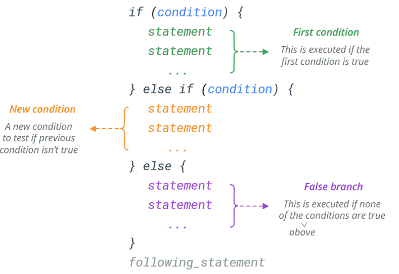
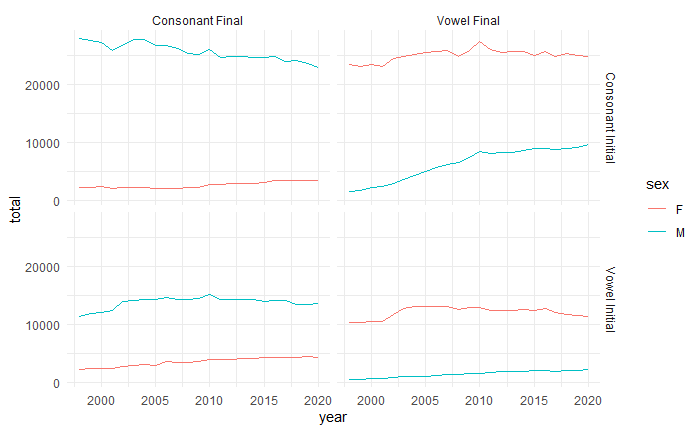

```{r,warning=FALSE}
library(tidyverse)
library(barnnamn)
library(ggrepel)
```

# Feedback from homework 2 (functions)

Feedback from homework 2 is on studium, under module 3. Have a look! 

# More string wrangling: str_replace(), str_to_lower() etc.

`str_replace()` and `str_replace_all()` are `stringr`'s find and replace functions. `str_replace()` only replaces the first match, whereas `str_replace_all()` will replace all matches (in a string).

```{r}
str_replace("stada","a","ä")
str_replace_all("stada","a","ä")
```

When using string replace, you may find regular expressions useful. See the second page of the `stringr` cheatsheet for a list of regular expressions.

Here, we use the regular expression `\\b`, which refers to a word boundary, to replace and s at the end of a word (but not the beginning).

```{r}
plurals <- c('cakes','biscuits','pies','sausages')
singulars <- plurals%>%
  str_replace('s\\b','')
singulars
```


Regular expressions are special characters that specify a search pattern. The sequence of characters `\\b` does not literally refer to `\\b`, it refers to a word boundary.

```{r}
str_replace("hi\\b","\\b","_")
```

In the final assignment, you will need to standardise free responses in our cake experiment. Below is an example of how `stringr` functions can help with this:

```{r}
responses <- c("a cake","some cakes","cake","Cake")

responses%>%
  str_replace("s\\b","")%>%   # get rid of plurals
  str_to_lower()%>%       # get rid of capitalisation
  str_replace("a\\b","")%>%   # get rid of 'a' before a word
  str_replace("some\\b","")   # get rid of 'some' before a word
```

The `str_to_lower()` function returns a lowercase version of the string (e.g. Cake > cake). There is also `str_to_upper()`, which will make everything uppercase (cake > CAKE), and `str_to_title()`, which will capitalise just the first letter (cake > Cake). Of these, `str_to_lower()` is probably the most useful.

Also, notice that without the word boundary regular expression, this code doesn't work:

```{r}
responses%>%
  str_replace("s","")%>%   # get rid of plurals
  str_to_lower()%>%       # get rid of capitalisation
  str_replace("a","")%>%   # get rid of 'a' before a word
  str_replace("some","")   # get rid of 'some' before a word
```

# Advanced mutating with %in% and functions

* We've seen how to use `if_else` to split a column of numeric values into two categories
* How about sorting non-numeric values like this?
* This is possible using `%in%`, which tests whether a value is in a vector:

```{r}
x <- c("a","b","c")
"a" %in% x
"b" %in% x
"c" %in% x
"d" %in% x
"e" %in% x
```

If you want to check if something is NOT IN a vector, use `!` ("not") around the ENTIRE expression:

```{r}
!("a" %in% x)
```


* This is very useful with the `barnnamn` data:

```{r}
vowels <- c("a","e","i","o","u","y")
barnnamn <- barnnamn %>% mutate(FinalLetter=if_else(str_sub(name,-1,-1) %in% vowels, "vowel", "consonant"))
barnnamn
```

Now we can do stuff like plot the proportion of vowel-final names over the years, by sex.

```{r,message=FALSE}
barnnamn %>% 
  filter(FinalLetter=="vowel") %>% 
  group_by(sex, year) %>% 
  summarise(Prop=sum(prop)) %>% 
  ggplot(aes(x=year,y=Prop,colour=sex)) + geom_line()+theme_classic()
```

Remember here this is one thing (proportion of vowel final names) changing over time, so we use `geom_line()`. 

### Changing the number of ticks on the x-axis

In the graph above, it only has ticks every five years. If you want to add more ticks, you can use the function `scale_x_continuous()` with the argument `n.breaks`, like this:

```{r,message=FALSE}
barnnamn %>% 
  filter(FinalLetter=="vowel") %>% 
  group_by(sex, year) %>% 
  summarise(Prop=sum(prop)) %>% 
  ggplot(aes(x=year,y=Prop,colour=sex)) + geom_line()+theme_classic()+scale_x_continuous(n.breaks=12)
```

## Functions for categorising things

* So far we've only really seen how to split things into two categories
* You can "nest" `if_else` to end up with more than two categories, but this gets clunky and hard to read pretty fast
* It's cleaner to write a function containing some `if/else if/else` statements to classify your data, like this: 

```{r,message=FALSE}
nettle <- read_csv("data/nettle_1999_climate.csv")

mgs_categorise <- function(mgs) {
  if(mgs < 4) {
    return("dry")
  } else if(mgs < 8) {
    return("typical")
  } else {
    return("fertile")
  }
}
```

## if, else if, else statements

The function above uses `if/if else/else` statements, this is how they work:

{width=70%}

For every row in the data that this function is run on, only one block of code will be executed--the first block where the condition evaluates to TRUE.

This means that the order of your conditions matters. For example, say we swapped the order of the first two conditions in our `mgs_categorise` functions, like this:

```{r}
mgs_categorise_swapped <- function(mgs) {
  if(mgs < 8) {
    return("typical")
  } else if(mgs < 4) {
    return("dry")
  } else {
    return("fertile")
  }
}
```

This is what happens when we run our original `mgs_categorise()` function on the data:

```{r}
nettle%>%
  rowwise()%>%
  mutate(MGS_category=mgs_categorise(MGS))
```

And this is what happens when we use our swapped function:

```{r}
nettle%>%
  rowwise()%>%
  mutate(MGS_category=mgs_categorise_swapped(MGS))
```

There are no "dry" rows when we use the swapped function, which isn't right! This is because the dry rows also satisfy the "typical" condition (MGS<8), and as this was the first condition in our function, as soon as it satisfied that condition it just executed the code returning "typical", without moving to the next condition where countries with MGS<4 are "dry". That's why it was important to have MGS<4 as the first condition, before MGS<8.

## rowise()

You're probably wondering what this `rowwise()` function is that I'm using before `mutate()`.
When we use `mutate()`, there are some functions that R assumes you want to apply to each row in a column separately, but other functions it assumes you want to apply to the entire column as a whole.

For example, basic math functions it assumes should be applied to each row in a column separately:

```{r}
nettle%>%
  mutate(Addition=Population+Area)
```

But functions like `mean()`, for calculating summary statistics, it assumes should be applied to the whole column:

```{r}
nettle%>%
  mutate(Mean=mean(Population))
```

This is also Rs default behaviour when the function is a user-defined function, and not a built-in R function (like with our `mgs_categorise` function).

Luckily, there is a function `rowwise()` that we can use to tell R explicitly that we want it to apply this function on each row in the column separately:

```{r}
nettle%>%
  rowwise()%>%
  mutate(Mean=mean(Population))
```

Of course, it is kind of meaningless to calculate the `mean()` of only a single number, so it makes sense why R assumes you want to apply it to the whole column in this case. But for our own user-defined functions, we sometimes don't want that behaviour. So that is where `rowwise()` can come in handy!

# Advanced plotting

## Multi-layered plots -- for adding labels etc.

* It's possible to add more than one `geom_` layer to a `ggplot`.
* For instance, having both `geom_point()` and `geom_text()` can be useful when we want to add an element `label` to our `aes()` (aesthesics):

```{r}
nettle_sample <- nettle %>% sample_n(20)
nettle_sample %>% ggplot(aes(x=Population,y=Langs,label=Country)) + geom_point() + geom_text()
```

* The `ggrepel` library can give us better label positioning, using the function `geom_text_repel()` instead of just `geom_text()`
* You will need to install and load the `ggrepl` library first (`install.packages("ggrepl") > library(ggrepl)`) 

```{r}
library(ggrepel) # this defines geom_text_repel as an alternative to geom_repel
nettle_sample %>% ggplot(aes(x=Population,y=Langs,label=Country)) + geom_point() + geom_text_repel()
```

This looks quite squished, with all the dots very close to each other, and in fact some dots aren't labelled because of this. We can improve the way this graph looks by plotting the log10 of the number of languages, instead of the raw language numbers, like this:

```{r}
nettle_sample %>% ggplot(aes(x=Population,y=log10(Langs),label=Country)) + geom_point() + geom_text_repel()
```

## Logarithmic transformations

Logarithmic transformations are often used to make data that is very spread apart easier to visualise.

The most common base is 10. When we take the log10 of a number, $x$, we are trying to find a number $y$ such that $10^y=x$. The function for this in R is just `log10(x)`. These $y$ numbers end up being much smaller and closer together than the raw $x$ values, which makes them nicer to plot. It is perfectly acceptable to do these kinds of transformations to your data, in order to make it easier to visualise :)

## Using multiple aes() functions

As well as the `aes()` in your `ggplot()` function, which applies to every layer in the graph. You can add `aes()` functions to individual elements of your graph separately (e.g. to `geom_point()`, or `geom_text_repel()`).

For example, below is a graph where the `colour` element is in the `ggplot()` function. That means the colour applies to *all* elements/layers of the plot.

```{r}
nettle_sample%>%
  rowwise()%>%
  mutate(MGS_category=mgs_categorise(MGS))->nettle_sample


nettle_sample %>% ggplot(aes(x=Population,y=log10(Langs),colour=MGS_category,label=Country)) + geom_point() + geom_text_repel()

```

If we move it so that the `colour` is only in the `aes()` of the points, then only the points will be coloured:

```{r}
nettle_sample %>% ggplot(aes(x=Population,y=log10(Langs),label=Country)) + geom_point(aes(colour=MGS_category)) + geom_text_repel()+theme_classic()

```

I've also added `+theme_classic()` here, which gives it a nicer look for printing (without the heavy grey background).

## Faceted plotting

* So far we have been plotting different components of our data on the same figure by varying e.g. colour
* But we can also use separate subplots for this
* These are called "faceted" plots in `ggplot`
* One or more columns can be used to determine the structure of the facets

```{r}
barnnamn %>% filter(name=="Lee") %>% ggplot(aes(x=year, y=n)) + geom_line() + facet_wrap("sex")
```

## facet_wrap()

* `facet_wrap()` is useful for building subplots based on a single column with many values
* IMPORTANT: You need to put a tilde ~ before the column name with facet_wrap, e.g. `facet_wrap(~FirstLetter)`

```{r,message=FALSE}
barnnamn %>% mutate(FirstLetter = str_sub(name, 1, 1))  %>%  
  # we want to look at each first letter separately, and each year separately, and then the different sexes separately as well
  group_by(FirstLetter,year,sex) %>% 
  summarise(total=sum(n))  %>%    # when you use summarise on grouped data, it keeps all the grouping columns 
  ggplot(aes(x=year, y=total, colour=sex)) + geom_line() + facet_wrap(~FirstLetter)
```

The x-axis is kind of ugly here with all the years swuished together. You can actually remove it altogether if you like, by adding the function `scale_x_continuous(labels=NULL,breaks=NULL)` -- this will get rid of the x-axis labels and ticks, like this:

```{r,message=FALSE,warning=FALSE}
barnnamn %>% mutate(FirstLetter = str_sub(name, 1, 1))  %>%  
  # we want to look at each first letter separately, and each year separately, and then the different sexes separately as well
  group_by(FirstLetter,year,sex) %>% 
  summarise(total=sum(n))  %>%    # when you use summarise on grouped data, it keeps all the grouping columns 
  ggplot(aes(x=year, y=total, colour=sex)) + geom_line() + facet_wrap(~FirstLetter)+scale_x_continuous(labels = NULL,breaks=NULL)+theme_minimal()
```

I've also added `+theme_minimal()` which I think looks nice for faceted plots.

## facet_grid()

* In addition to `facet_wrap`, you can use `facet_grid`
* `facet_grid` uses one column to sort the subplots into columns, and another column to sort the subplots into rows. This works better with columns that only have a few values, but becomes hard to look at if you try to facet_grid on a column with lots of values.
* E.g. `facet_wrap(sex~Final)` will make a grid of plots where the rows are the different values of `sex`, and the columns are the different values of `Final`, like this:

```{r,message=FALSE}
barnnamn %>% 
  mutate(FinalLetter = str_sub(name, -1, -1))  %>%  
  mutate(Final = if_else(FinalLetter %in% c("a",'ä','ö','å', "e", "i", "o", "u", "y"), "vowel", "consonant")) %>% 
  group_by(Final,year,sex) %>% 
  summarise(total=sum(n))  %>% 
  ggplot(aes(x=year, y=total)) + geom_line() + facet_grid(sex ~ Final)+theme_minimal()
```

We could have done this just by colouring the lines according to sex (and I think that this is actually easier to look at), but say you were only able to print in black and white, then a faceted grid like this might be a good solution. 

# Homework exercise

* Modify the `barnamn` data to add two new columns. The first new column should indicate whether the name *begins* in a vowel or a consonant. The second new column should indicate whether the name *ends* in a vowel or a consonant. **Hint**: You will need to use `str_sub` from the `string_r` package.  
* Then use `grid_facet` with `ggplot` to plot the *total* number of names beginning with vowels/consonants, versus ending with vowels/consonants over the years
* Use colour to plot the data for male and female names separately on each of these 4 subplots. 
* Use `+theme_minimal()` to make it a nice clean graph that would print well.

You are aiming for something that looks like this:




