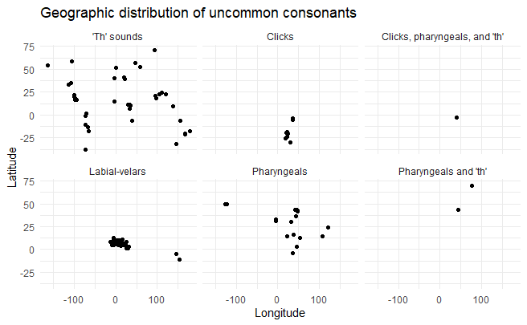
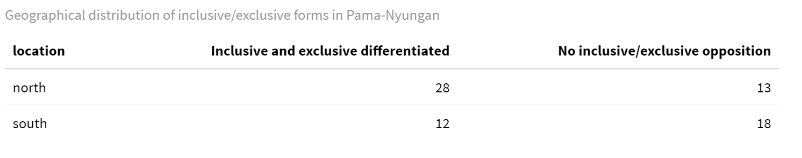

# Homework Question

The homework exercise for this week has three parts. You will need to use the files `mywals.csv`--which I just made from the `mywals` dataset we made here--uploaded under the module for this lecture, and the file `languages.csv` which you should already have, but just in case I've uploaded that too in the modules.

**Part 1: Add Latitude and Longitude Information to mywals**

The file language.csv contains information about the latitude and longitude of where the different languages in mywals are spoken. I want you to add these latitude and longitude columns to the mywals dataset, joining based on the language-ID column. You will need to rename the appropriate column in the languages data before the join, and it's good if you just select the columns you need for the join before joining the datasets, so you don't end up with heaps of columns. Make sure to use the right type of joining function!

**Part 2: Plot the geographic distrubution of uncommon consonants**

1. Take your new data that has the latitude and longitude information, and focus on the rows concerning the feature, "Presence of Uncommon Consonants".
2. Get rid of rows where the description for this feature is "None"
3. Plot the remaining languages on a graph with Longitude as the x-axis, and Latitude as the y-axis. Use `facet_wrap()` to make a separate graph for each different value of the feature, and `+theme_minimal()` to get a nice look for your graph. It should look something like this:




Can you tell which uncommon consonants appear to be areally distributed?

**Part 3: Make a wide table showing the geographic distribution of inclusive/exclusive pronouns in Pama-Nyungan**

1. Take your new data that has the latitude and longitude information, and focus on the rows concerning the feature, "Inclusive/Exclusive Forms in Pama-Nyungan".
2. Add a new column, containing the value "south" if the latitude for that language is less than the mean latitude for the whole dataset, or "north" otherwise (HINT: you will need to use another function together with mutate; take a look at the course cheatsheet and look at how you categorise data if you get stuck!)
3. Count the values in the Description column (i.e inclusive and exclusive differentiated versus no opposition), for each type of location (north/south) separately [HINT: search the course cheatsheet for 'working on groups within columns' if you get stuck]
4. Use the function pivot_wider to make a wide dataset whether the columns are the Description (inclusive and exclusive differentiated or not), and the values are the counts (n) 
5. Use kable() and kable_styling() to make a pretty version of this table, with the caption "Geographical distribution of inclusive/exclusive forms in Pama-Nyungan" (or something similar)

It should look like this:




You can also see this nicely on a map through the wals website, [here](https://wals.info/feature/39B#4/-25.40/133.55).

# Feedback

* Everyone did this really well! 
* I think you are all very competent at coding in R now, so you should be really proud! Especially because you have only been learning for a few weeks.
* Since you all did so well, at this stage we can start to think about extra stuff like the presentation of your R markdown documents. 
* Things that make a well-presented R markdown document are:
  - The document is divided into clear and appropriate sections using markdown headings (e.g. # Level 1 Heading, ## Subheading for level 1, # Level 2 Heading, etc.)
  - Your code is also divided into appropriate chunks:
    - setup chunk: load required packages, raw data, and set chunk options
    - preprocessing chunk: go between the raw data format to the tidy data format you will use for all your analyses
    - then one chunk for every output (e.g. table, figure); if you need to do some additional data wrangling to create that output, I would include that in the same chunk that produces the output. 
    - If it is an output (table/figure) or if it gets reused (tidy dataframe), then it gets its own chunk. But otherwise don't create separate chunks for things that are just intermediate steps towards one bigger goal. 
  - Use comments to summarise what a block of code does, and explain why you are doing something where necessary. You don't need to use comments to explain what functions do; but you can do this if it's helpful to you. 
  - Always introduce (and explain) your figures/tables in the markdown text before the figure
  - In the markdown text after the figure, include text where you interpret what the figure shows.
* I have tried to give an example of what I mean by this in the .Rmd document for this homework solution; so take a look at it and particularly how I have named the chunks, used comments, and divided up the sections.
* Also take a look at the options I have set in the yaml header for the document. As I am presenting this like a research report, I have used the html_document format instead of the notebook format, and by default I am having the code set to hidden. This is how I want you to present your research report for the final assignment as well.
* I have also added some extra stuff to this homework solution, which is plotting the data on a map. Since we are also getting data from all over the world and different parts of Sweden for our final assignment, I thought it might be good to teach you how to do this as well. We will go over it together in the next lesson :)

# Solutions

```{r setup, include=FALSE}
# required packages
library(tidyverse)
library(kableExtra)
library(rnaturalearth)
library(rnaturalearthdata)

# raw data
mywals <- read_csv("data/mywals.csv")
languages <- read_csv("data/languages.csv")

# chunk options
knitr::opts_chunk$set(echo = TRUE,warning = FALSE,message = FALSE)
```

## The geographic distribution of uncommon consonants

The plot below shows the geographic distribution of uncommon consonants in the WALS data.

```{r plotting distribution of uncommon consonants}
# Take Latitude and Longitude information from languages and add to the wals data
languages %>% 
  rename(Language_ID=ID) %>% 
  select(c("Language_ID","Latitude","Longitude"))%>%
  right_join(mywals,languages,by="Language_ID")->mywals_geo   

# Plot the distribution of uncommon consonants
mywals_geo %>% 
  filter(Feature=="Presence of Uncommon Consonants") %>% 
  filter(Description!="None") %>% 
  ggplot(aes(x=Longitude,y=Latitude))+labs(title="Geographic distribution of uncommon consonants in the WALS data")+geom_point()+facet_wrap(~Description)+theme_minimal()
```

We can see that while 'th' sounds and pharyngeals have a fairly wide geographic distribution, clicks and labial-velars (e.g. kp, gp) appear to be areally distributed. 

Plotting them on a world map, we can see that these sounds are primarily found in Africa.

```{r mapping clicks and labialvelars}
areal_features <- c("Clicks","Labial-velars")

# pick out the areal features to map
mywals_geo %>% 
  filter(Feature=="Presence of Uncommon Consonants") %>% 
  filter(Description %in% areal_features)%>%
  rename(`Uncommon consonants`=Description)%>%
  select(`Uncommon consonants`,Latitude,Longitude)->map

# get a map of countries of the world from the natural earth pacakge, sf is a map format
world <- ne_countries(returnclass = "sf")

# plot the areal features over the world map
world%>%
  ggplot()+
  geom_sf()+
  geom_point(data=map,aes(x=Longitude,y=Latitude,colour=`Uncommon consonants`))+theme_void()
  
```

## Inclusive and exclusive forms in Pama-Nyungan

The table below shows the geographical distribution of inclusive/exclusive forms in Pama-Nyungan.

```{r pamanyungan table}
# Part 3
mywals_geo %>% 
  filter(Feature=="Inclusive/Exclusive Forms in Pama-Nyungan") %>% 
  mutate(Location=if_else(Latitude>mean(Latitude),"North","South")) %>% 
  count(Description,Location) %>% 
  pivot_wider(names_from=Description,values_from=n) %>% 
  kable(caption="Geographical distribution of inclusive/exclusive forms in Pama-Nyungan",col.names=c("Location","Inclusive and exclusive differentiated","No inclusive/exclusive opposition")) %>% 
  kable_styling()

```

We can see that languages in the north are more likely to have an inclusive/exclusive distinction in their pronouns, while languages in the south are less likely to distinguish this opposition.

This is also shown on the map below:

```{r pamanyungan map}
# get map of australia
australia <- ne_countries(country ="Australia",returnclass = "sf")

# get pronoun data
mywals_geo %>% 
  filter(Feature=="Inclusive/Exclusive Forms in Pama-Nyungan") %>% 
  mutate(Location=if_else(Latitude>mean(Latitude),"North","South"))%>%
  rename(`Pronoun System`=Description)-> pronouns

# plot pronoun data on australia
australia%>%
  ggplot()+
  geom_sf()+
  geom_point(data=pronouns,aes(x=Longitude,y=Latitude,colour=`Pronoun System`))+
  theme_void()
```

