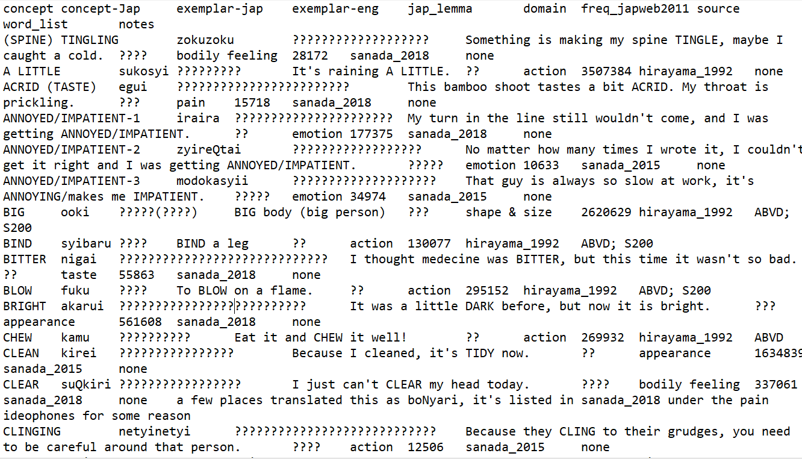

```{r setup, include=FALSE}
knitr::opts_chunk$set(echo = FALSE)
```

## Admin

* There are two courses in studium at the moment that are linked with this class
   - Lingvistisk forskning och forskningsmetoder 
   - Lingvistisk forskning, samläsning 
* This is the first time the course has been run in studium and it is a bit unorganised
* **Lingvistisk forskning, samläsning** is the correct course
* But the people who enrol from outside linguistics B end up in the other course, so we've sent you an invitation to the *samläsning* course, and once you accept that I'll take you out of the other course and you can just be in the *samläsning* course.
* Sorry for the confusion!

## Introductions

1. Name
2. Native language + other languages you speak
3. Favourite area(s) of linguistics (e.g. Phonetics, Phonology, Morphology, Syntax, Semantics, Pragmatics, Sociolinguistics, Historical Linguistics, Corpus Linguistics, Forensic Linguistics etc.)
4. Operating system (Windows/Mac/Linux)

## About the course

These are the main topics we will cover:

* Formulating good research questions (today)
* Best practices for reproducible research (also today)
* Data wrangling and visualisation in R/RStudio (the bulk of the course)
* Carrying out linguistic research - we will carry out our own linguistic experiment (about cake) and you will need to analyse the data for your final assignment

We will also cover some basic statistical concepts and statistical tests, but this is not the focus of the course. 

## If you want to know more about statistics

I can recommend these textbooks, but they are by no means required!

Levshina, Natalia. 2015. *How to do linguistics with R: Data exploration and statistical analysis.* John Benjamins Publishing Company.

Winter, Bodo. 2020. *Statistics for linguists: an introduction using R.* Routledge

But I also recommend you to enrol in a dedicated statistics course at some point if you really want to understand statistical concepts in depth. 

## Prerequisites

None!

I will be teaching you how to do everything from the very beginning in class, so don't stress!

## Assessment

* Weekly assignments (starting next week)
* A final report (about the experiment that we will run together)
* No exam!
* All assessment is handed in online via studium. 
* I will weight it so that the earlier assignments are worth less than later assignments, so don't worry if you find them difficult at first. 
* Final grades are fail/pass/pass with distinction

## Schedule

* Courses are on Thursdays from 14:15 to 16:00
* Except in week 19, because Thursday is a public holiday, we are scheduled to have class on *Wednesday* from 12:15 to 14:00. That's Wednesday the 12th of May. 
* This is a kind of annoying time slot, if no one has anything else on from 14:15 to 16:00 on Wednesdays we could just use the same time slot as usual?
* The final assignment will be due Friday the 4th of June. 
* You can see the full schedule with the dates for all the assignments in the **Syllabus** section on studium. 

## Questions?

## Doing linguistic research

* Linguistics is a very broad discipline, but there are principles and best practices for doing linguistic research (or any research) that apply to all of us, no matter what field. 
* In this first lecture, I'm going to go over these principles that you should have in your head before you even begin a research project.
* The rest of the course will be about ways of handling and analysing linguistic data in R. 

## Quantitative and Qualitative research

* **Quantitative research**: research that involves *counting* or *measuring* something.
* **Qualitative research**: research that involves *describing* something.
* We will be focusing on *quantitative research* during this course, as this is the kind of data that is best suited to analysis with R. However, the principles for doing linguistic research that I will discuss today apply equally to both qualitative and quantitative data.
* In reality, most linguistic research is likely to involve both quantitative and qualitative elements. Language is not the kind of process that can be captured by numbers alone.
* However, where we do have linguistic data that we can measure, this can be really useful for answering certain kinds of linguistic questions, provided we use the right methods!

## How to do quantitative research

```{r research_process}
library(DiagrammeR)
grViz("digraph flowchart {
      # node definitions with substituted label text
      node [fontname = Helvetica, shape = rectangle]        
      tab1 [label = '@@1']
      tab2 [label = '@@2']
      tab3 [label = '@@3']
      tab4 [label = '@@4']
      tab5 [label = '@@5']

      # edge definitions with the node IDs
      tab1 -> tab2 -> tab3 -> tab4 -> tab5;
      }

      [1]: '1. Observation'
      [2]: '2. Question'
      [3]: '3. Hypothesis'
      [4]: '4. Measurements (data collection)'
      [5]: '5. Analysis'
      ")
```

A good study should have all these elements, they should all link together, and you should think about all of them before you start your project!

## Checklist for good research questions

Make sure your research questions are:

* grounded in observation/previous research ✔
* entail (specific) hypotheses ✔
* these hypotheses should be testable/measurable ✔
* and the results amenable to appropriate statistical analyses ✔

## Example: phonetics

* Kluender et al. 1988, *Vowel-length differences before voiced and voiceless consonants: an auditory explanation*.
* **Observation**: "A widely attested finding, approximating a true phonetic universal, is that voiced stops tend to be preceded by longer vowels than voiceless stops"
* **Question**: *Why?*

## VOT distinguishes voiced versus voiceless stops

VOT stands for 'voice onset time'. It refers to the length of time between the release of the stop and the onset of voicing (=vibration of the vocal folds). Voiced stops (e.g. /b/) have a short VOT, and voiceless stops (e.g. /p/) have a long VOT. VOT is the main thing that determines whether a stop is perceived as voiced or voiceless. 


## Hypothesis

People vary the length of their vowels before voiced/voiceless consonants to make this voicing contrast easier to perceive: a long vowel should make a short VOT seem even shorter *by comparison* (hence making the consonant sound more voiced), while a short vowel should make a long VOT appear longer by comparison (hence making the consonant sound more voiceless).

## Measurements

* Recorded someone saying /apa/, then edited that sound file creating multiple versions with different VOT for the consonant, and different durations for the initial vowel.
* Asked people to listen to these different sound files and record whether they heard /apa/ or /aba/. 

## Analysis

* As expected, VOT predicts whether people hear a voiced or voiceless stop
* But for ambiguous cases, the length of the preceding vowel can also play a role


## Research feeds research

```{r research_process2}
library(DiagrammeR)
grViz("digraph flowchart {
      # node definitions with substituted label text
      node [fontname = Helvetica, shape = rectangle]        
      tab1 [label = '@@1']
      tab2 [label = '@@2']
      tab3 [label = '@@3']
      tab4 [label = '@@4']
      tab5 [label = '@@5']

      # edge definitions with the node IDs
      tab1 -> tab2 -> tab3 -> tab4 -> tab5;
      tab4 -> tab1;
      }

      [1]: '1. Observation'
      [2]: '2. Question'
      [3]: '3. Hypothesis'
      [4]: '4. Measurements (data)'
      [5]: '5. Analysis'
      ")
```

## How do we keep this cycle going?

* With FAIR data!

{width=50%}

Why?

* (Unselfishly) It helps advance the field
* (Selfishly) citations!

## Making your data findable and accessible: data repositories

* Data can be made more FAIR by submitting it to specialised **data repositories**.
* These are organisations, usually non-commercial, whose sole job is securely and reliably storing scientific data and making it available over the internet.
* There are lots of discipline-specific repositories, but a popular repository for linguistics is [OSF](https://osf.io/) (Open Science Framework).
* They store your data and keep it safe for you for free! While also making it findable, accessible and citable :)

## Tips for making your data findable 

* Provide a short description
* Use tags! (called ['topics'](https://docs.github.com/en/github/administering-a-repository/classifying-your-repository-with-topics) on Github)
* If you're not sure what tags to use, take a look at other OSF projects/github repositories from people in your field.
* [Example OSF project](https://osf.io/4bp2y/)

## Data licensing

* It's important that people who can access your data know exactly what they're allowed to do with it.
* This is often achieved by means of selecting a *copyright license* for the data.
* Creative Commons licenses are a popular choice for datasets.
* They basically state that people can do whatever they want with your data, as long as they cite you. 
* You can read more about the specifics of the different creative commons licenses [here](http://www.creativecommons.se/om-cc/licenserna/)


## Github

* OSF is really good for storing datasets, but code is usually stored on [Github](https://github.com/).
* Github is a free service for storing code online
* It is also a *version control system*

## What is version control?


* This is what version control looks like at its worst.
* [This](https://github.com/BonnieMcLean/ShinySurvey) is what it looks like at its best, with git.

## Linking github and OSF

* Github and OSF repositories can be linked! We will see how to do this later in the course. 
* Github isn't good at handling large files, so its better to keep big datasets on OSF
* But OSF isn't as good as git for version control, so things like code that you are likely to change a lot you should keep on github

## Making your data interoperable and reusable

* It's great if your data is findable and accessible (through OSF/Github), but this is kind of useless if its in a format that nobody can work with.
* **Plain text file formats are good, .pdf and .xlsx are bad!**
* .pdf is just completely useless, you can't get the data out and do anything with it, you can only look at it.
* .xlsx is hard for programming languages (e.g. R, Python) to read, you usually have to convert .xlsx documents into plain text files before you can really work with them, so it's nice if you just convert them beforehand for people when you share the data.
* Excel files are not reliable/secure in the long-term
  - .xlsx can only be opened by excel software; it's possible that in the future this software will become outdated/not exist
  - whatever spreadsheet software eventually replaces excel may not be able to open .xlsx files
  - even different versions of excel process data differently
* Plain text files are much safer because they are just that--plain text--they don't require any special software to be read correctly; they can be read by anyone (human or computer)

## This doesn't mean you can never use excel again

* Excel is very convenient when you are making a database and entering data (you don't have to worry about creating columns and you can easily see where those columns are; plain text is not readable compared to excel). 
* Just don't save/share your data in .xslx, use a plain text format!
* Excel can also save in plain text format, and read plain text files (we will practise doing this later)
* While you are making the database, use excel, but save it in a plain text file for when the time comes to *use/analyse* the data (in R)

## Plain text formats

* There are two main plain text formats used for storing spreadsheet-style data: .csv and .tsv
* .csv stands for comma separated values
* .tsv stands for tab separated values
* they're not very pretty/readable, but they can be easily read into any computer program and you can look at the data in there
* this simple way of storing data also makes it faster for computers to process (which is good when we are doing a lot of *data wrangling* in R)

{width=70%}

## When to use csv and when tsv?

* tsv is *necessary* when you have commas in some of your fields (e.g. if you have a field with example sentences)--csv won't work here!
* tsv is also safest (you don't run into problems with delimiters)
* but csv can be more convenient to work with when you are editing data a lot because most software (like excel) will know how to read it and open it up immediately, whereas with tsv you sometimes have to tell the software how to read it/import it
* because of this, csv is still more popular (even though tsv is technically better)
* whatever you choose, csv or tsv will always be a LOT better than .xlsx or .pdf and people will thank you for using these formats!

## Text encodings

* The other thing you have to think about when sharing your data is the *encoding*
* Often, when you save your data from a mac or PC, it saves the text in an encoding that is only readable by macs, or only readable by PCs, or only readable by computers from a certain country, etc.
* When someone with a different computer to you goes to open that file, this is what they see:

{width=70%}

* It's very stressful/scary!


## Use UTF-8!

* UTF-8 is a very widely supported text encoding which is capable of accurately and reliably saving characters from just about every writing system on Earth plus specialist characters like IPA symbols and mathematical notation.
* Basically every computer in every country can read it.
* We will learn how to save files in UTF-8 encoding later in the course (it's not very hard)

## Making your data interoperable and reusable: include a ReadMe!

* ReadMes are very important, don't forget one!
* In the ReadMe you should clearly explain *where* the data came from (who were the speakers? what was the dictionary/wordlist?), *how* it was collected (what did you ask/show the speakers to get those words? did you use sentence frames?), *what the columns are* in your data (explain acronymys/shortforms in column names, if there's a column called *freq*, frequency where?), any *transcription systems used* (if not IPA), etc.
* Your ReadMe documents should also be in plain text format!
* We will be learning a really great plain text format called *markdown* in the next lecture
* These slides are written in markdown, and R notebooks also use markdown
* Even if civilisation collapses, you will still be able to read these slides because they were written in markdown, which is plain text!
* [Example of a ReadMe](https://github.com/BonnieMcLean/Japonic-sensory-vocab/blob/main/README.md) (written in markdown)

## Reproducibility

* A study is *reproducible* if you can take the original data and the computer code used to analyze the data and reproduce all of the numerical findings from the study.
* FAIR data leads to reproducibility, which is like the 'gold standard' of 'good research practice'.

## Why make your study reproducible?

* Reproducible studies are more 'trustworthy'. Having the data and code makes it easier for people (including reviewers/supervisors/colleagues etc.) to *check* the analyses you did.
* You shouldn't be afraid of this; science is a collaborative effort, and everybody makes mistakes (even fancy professors). People just want to be able to look out for you and help you so that you can do your best research.
* Doing the things you'll learn in this course (FAIR data, version control, etc.) will make this easier for them.

## Why make your study reproducible?

* It also allows people to *re-analyse* your data (perhaps asking different questions), or, to run the *exact same analysis* on their own data.
* This helps advance the field, while also getting you more citations :)

## How can R help?

* This is where R comes in.
* It is very difficult (basically impossible) to publish a reproducible study without coding your analyses.
* But there are many more reasons to use R in your research as well

## Benefits of R

* It makes it easier to identify (and fix) mistakes in your analysis. Very often, you don't realise there is a problem with how you've analysed something until a while after you've done it. When your analysis is coded, this is easy to go back and fix. But if you just did it using some software (e.g. Excel, SPSS), there is no record of what you did and you are likely to forget, so the mistake goes uncorrected. 
* It reduces your workload when writing up papers!
  - R supports Markdown, which is a way of creating formatted text (e.g. for a paper) using a plain text editor.
  - These slides are created using Markdown in R.
  - Being able to write your paper in R (using Markdown) means that you can generate all your figures etc. in the paper directly from your code, so if you ever need to change anything in the figure, you can quickly update the code and the figure is also updated in your paper. No more needing to save your figures and insert them into word documents!
  - R Markdown allows you to create output as a [html (web) document](https://bonniemclean.github.io/notebookjap) (which also means you can have interactive plots), as a slidy presentation (what you are seeing now), or as a word document (good for sharing with your supervisors for feedback) or PDF. You can even write [whole books](https://bookdown.org/yihui/rmarkdown/) using R and Markdown.
  - There are many more kinds of output too (e.g. websites, handouts, dashboards), see [here](https://rmarkdown.rstudio.com/gallery.html) for examples.
* It is also integrated with Git and Github, so working in R makes version control super easy, leading to way less stress later on!

## Homework

Install R and RStudio, then download the R Project for this class. We will start working in this project from next week .

1. Install R from the <https://cran.rstudio.com/>
2. Install RStudio desktop version for your platform (Windows, Mac, Linux) from <https://www.rstudio.com/products/rstudio/download/#download> (or search for "RStudio download")
3. Download and unzip the ResearchInLinguistics zip file from the R Project section on the modules page in Studiuum

- If you need help, I have virtual office hours on Mondays from 14 to 16. Email me to set up a zoom meeting. If those times don't work for you, you can also email me to set up a meeting at another time. 
- You can also post questions to the **Discussions** section of the course in studium and I will answer them there. 
- If for some reason you still can't get RStudio working on your computer, I have set up an [Emergency R App](https://bonnie-mclean.shinyapps.io/EmergencyR/) where you should be able to run all the R code that we use in class, so that you can still follow along during the lectures. However, you should make an appointment with me to get RStudio installed on your computer as you will need it to do the homework assignments and the final assignments. 

I will also upload these slides and any other materials from our lectures to the relevant module for each lecture in the Modules section on Studium after each class. 

## One more buzzword: replicability 

* *Replicability* is the act of repeating an entire study, independently of the original investigator without the use of original data (but generally using the same methods).
* You may have heard of the **Replication Crisis** in psychology.
* In 2015, the journal *Science* published the results of an attempt to replicate 100 experimental and correlational psychology studies that had been published in three prominent psychology journals. Despite the care taken to reproduce the experiments exactly, more than half of the studies failed to replicate. When the effects were replicated, they tended to be smaller or weaker than those of the original study. 
* This is not just a problem for pyschology, but is widespread in science generally (including linguistics).
* It is often attributed to a combination of publication bias and low-power research designs. Publications favor flashy, positive results, making it more likely that studies with larger-than-life effect sizes are chosen for publication.
* **Replication studies** are now becoming increasingly popular and encouraged.
* This doesn't necessarily mean just doing the exact same thing; you can 'challenge/test' the results of the original study by, for e.g., using larger sample sizes, a different demographic of participants, introducing more control measures/randomisation, etc. (we will talk more about good experiment design in a later lecture)