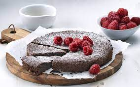
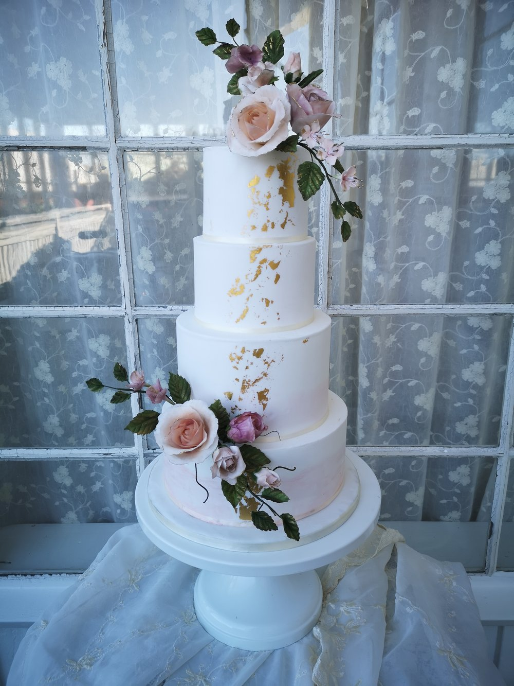

```{r setup, include=FALSE}
knitr::opts_chunk$set(echo = FALSE)
```

## Reminder

```{r research_process}
library(DiagrammeR)
grViz("digraph flowchart {
      # node definitions with substituted label text
      node [fontname = Helvetica, shape = rectangle]        
      tab1 [label = '@@1']
      tab2 [label = '@@2']
      tab3 [label = '@@3']
      tab4 [label = '@@4']
      tab5 [label = '@@5']

      # edge definitions with the node IDs
      tab1 -> tab2 -> tab3 -> tab4 -> tab5;
      tab4 -> tab1
      }

      [1]: '1. Observation'
      [2]: '2. Question'
      [3]: '3. Hypothesis'
      [4]: '4. Measurements (data collection)'
      [5]: '5. Analysis'
      ")
```

## Let's do our own linguistic research

```{r, include=FALSE}
colorize <- function(x, color) {
  if (knitr::is_latex_output()) {
    sprintf("\\textcolor{%s}{%s}", color, x)
  } else if (knitr::is_html_output()) {
    sprintf("<span style='color: %s;'>%s</span>", color, 
      x)
  } else x
}
```


**Observation**: Swedish and English cake terminology don't always seem to match up

|                                          |                                    |                                     |
|------------------------------------------|------------------------------------|-------------------------------------|
|{width=150px}        |kladd`r colorize("kaka","blue")`    |chocolate `r colorize("cake","blue")`|
|{width=150px}  |bröllops`r colorize("tårta","red")` |wedding `r colorize("cake","blue")`  |
|{width=150px}         |hallon`r colorize("paj","purple")`|raspberry `r colorize("tart","red")` |  

## Let's do our own linguistic research

**Question**: Although they seem to come from the same root, how comparable are the meanings of words like *tårta* and *tart*, *kaka* and  *cake*, *paj* and *pie*?

**Hypothesis**: Although they sound the same, they do not have the same meanings. 

## Let's collect some measurements!

* We can test this with some simple experiments.
* Show Swedish people different pictures of cakes, and get them to label them as *kaka*, *tårta*, *paj* etc.
* Show English people these same cake pictures, and get them to label them as *cake*, *tart*, *pie*, etc. 
* Words that are closer in meaning will be used as labels for the same pictures more often.
* We can analyse this data using distance measures, which we'll talk about next week!

## Making online experiments in RShiny

* Shiny is an R package that lets you build interactive web apps straight from R
* It is mainly used for displaying data in an interactive way.
* Examples:
  - [Visualising biodiversity in American national parks](https://abenedetti.shinyapps.io/bioNPS/?_ga=2.113832391.1791983055.1616686305-234975814.1606141674)
  - [Uppsala's Crush Covid App](https://crush-covid.shinyapps.io/crush_covid/)
  - [A linguistic example](https://bonnie-mclean.shinyapps.io/ideophonesacrossjapan-eng/)
* But we can also use it to make online experiments! 

## Using shiny to run online experiments

|                           |Survey software (e.g. Qualtrics)|Javascript/HTML/PHP|Shiny     |
|---------------------------|--------------------------------|-------------------|----------|
|Cost                       |$\$\$                           |Low                |Low/Free* |
|Learning curve             |Low                             |High               |Medium    |
|Customisation              |Low                             |High               |High      |
|Data and stats integration |Low                             |Low                |High      |

* Pretty much everything you can do with javascript, you can do with shiny, but it has the added advantage of being easier to learn and write (since it is built on R, which you already know). 
* Also, since you are likely to use R for data analysis, it is nice to have the data already in a format that R can work with. 
* Running your experiments in RShiny simplifies your workflow from data collection > analysis

\* shinyapps.io provides free hosting for up to 5 apps, with up to 25 active hours per month. After that you have to pay a monthly fee to increase the number of apps/active hours per month (the cheapest option is $9/month for 25 apps and 100 active hours)

## Demo

* You can find an English version of the experiment [here](https://bonnie-mclean.shinyapps.io/BakedGoodsSurvey/)
* We will be building the Swedish version in class together today. 
* There is also a [demo on my github](https://github.com/BonnieMcLean/ShinySurvey/blob/main/app.R), with detailed instructions particularly for writing to google sheets. 
* More [shiny tutorials](https://shiny.rstudio.com/tutorial/)
